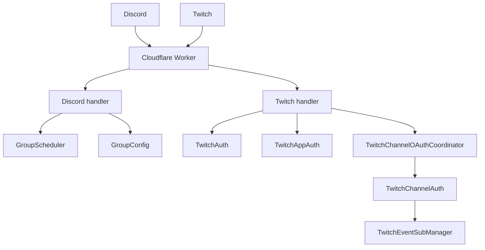

# Elmybot

Elmybot is a multi-platform Discord and Twitch bot built on Cloudflare Workers
and Durable Objects.

Discord sends signed interaction requests to the Worker. Twitch sends signed
EventSub webhook notifications. The Worker validates each platform request and
delegates durable scheduling, configuration, OAuth, and subscription state to
purpose-specific Durable Objects. No continuously running bot process or
WebSocket connection is required.

## Current capabilities

### Discord

- Health and responsiveness: `/alive`
- Timestamp scheduling:
  - `/pingroleat`
  - `/pingmeat`
  - `/sayat`
- Bounded random-interval scheduling: `/sayat_random`
- Daily and repeated random schedules
- Optional KLIPY GIF search for scheduled messages
- Scheduler administration:
  - `/doat_list`
  - `/doat_cancel`
  - `/doat_dead_letters`
- Per-server role authorization:
  - `/config_allow_role`
  - `/config_disallow_role`
  - `/config_list_entries`
  - `/config_show_value`

### Twitch

- Signed EventSub webhook handling at `/twitch`
- Durable message-ID deduplication for EventSub retries
- `!alive` chat command
- Chat replies through the Twitch Send Chat Message API with an app access token
- Validation and structured classification of Twitch chat delivery results
- Durable bot OAuth authorization, refresh-token rotation, and hourly validation
- Moderator-free channel authorization through the `channel:bot` scope
- One-hour, single-use broadcaster invitation links
- Per-broadcaster OAuth storage, refresh, validation, disconnect, and
  reauthorization state
- Protected EventSub subscription creation and inspection
- Per-channel desired state and reconciliation approximately every 55 minutes
- Automatic recreation of missing or unhealthy chat subscriptions
- Automatic recovery from `notification_failures_exceeded` revocations
- Safe deconfiguration after broadcaster authorization is revoked or disconnected

## Architecture



### Worker routing

`src/index.js` is the composition root and public Worker entrypoint.

| Route | Purpose |
|---|---|
| `/discord` | Discord health check and signed interactions |
| `/twitch` | Twitch health check, EventSub verification, notifications, and revocations |
| `/twitch/oauth/*` | Bot-account OAuth setup |
| `/twitch/channels/*` | Broadcaster invitations and OAuth lifecycle |
| `/twitch/eventsub/*` | Protected subscription and desired-state administration |

### Durable Objects

| Binding | Class | Identity and responsibility |
|---|---|---|
| `SCHEDULER` | `GroupScheduler` | One object per scheduling group; Discord uses `discord:guild:<guildId>` |
| `CONFIG` | `GroupConfig` | One object per platform group; Discord uses `discord:guild:<guildId>` |
| `TWITCH_APP_AUTH` | `TwitchAppAuth` | Singleton Twitch app-access-token lifecycle shared by chat and EventSub |
| `TWITCH_AUTH` | `TwitchAuth` | Singleton bot OAuth token lifecycle |
| `TWITCH_CHANNEL_OAUTH` | `TwitchChannelOAuthCoordinator` | Singleton broadcaster OAuth states and hashed invitation records |
| `TWITCH_CHANNEL_AUTH` | `TwitchChannelAuth` | One object per broadcaster OAuth session |
| `TWITCH_EVENTSUB_MANAGER` | `TwitchEventSubManager` | One object per broadcaster for EventSub desired state and reconciliation |
| `TWITCH_EVENTSUB_SERVICE` | `TwitchEventSubService` | Singleton coordinated EventSub API access and per-broadcaster mutation serialization |
| `TWITCH_CHANNEL_REGISTRY` | `TwitchChannelRegistry` | Singleton channel membership index; stores no OAuth tokens or secrets |

All currently configured Durable Object classes use SQLite-backed namespaces.
Migration tags in `wrangler.jsonc` are append-only after deployment.

## Discord behavior

### Commands

| Command | Required options | Optional options | Purpose |
|---|---|---|---|
| `/alive` | None | None | Check responsiveness |
| `/pingroleat` | `timestamp`, `role` | `repeat_daily` | Schedule a role ping |
| `/pingmeat` | `timestamp`, `user` | `repeat_daily` | Schedule a user ping |
| `/sayat` | `timestamp`, `message` | `repeat_daily`, `gif` | Schedule a plain message or GIF result |
| `/sayat_random` | `message` | `min_interval`, `max_interval`, `repeats`, `gif` | Schedule after a bounded random interval |
| `/doat_list` | None | None | List the first 15 scheduled jobs |
| `/doat_cancel` | `job_id` | None | Cancel a scheduled job |
| `/doat_dead_letters` | None | None | Show the five most recent terminal delivery failures |
| `/config_allow_role` | `role` | None | Allow a role to use scheduling commands |
| `/config_disallow_role` | `role` | None | Remove an allowed role |
| `/config_list_entries` | None | None | List stored configuration keys |
| `/config_show_value` | `entry` | None | Inspect a configuration value |

The `gif` query is limited to 20 characters. Missing or whitespace-only queries
use plain-text mode. GIFs are resolved at delivery time so repeated jobs may
receive different results.

### Request handling

`src/platforms/discord/handler.js`:

1. Verifies `X-Signature-Ed25519` and `X-Signature-Timestamp` against the raw
   interaction body.
2. Responds to Discord endpoint-validation PINGs.
3. Routes slash commands from `src/platforms/discord/commands.js`.
4. Immediately acknowledges deferred commands and completes them through
   `ctx.waitUntil(...)`.
5. Edits the original interaction response with a safe result or a correlation
   ID that can be matched to Worker logs.

### Permissions

- `/alive` is public.
- `config.manage` requires the server owner or a moderator.
- `schedule.create`, `schedule.view`, and `schedule.cancel` allow the owner,
  moderators, or members with a configured allowed role.
- Moderator status is inferred from Discord permission bitfields.
- Role allowlists are stored in `GroupConfig`.
- Discord configuration identities are platform-namespaced as
  `discord:guild:<guildId>`, matching scheduler identities. On first access,
  existing raw-guild-ID configuration is copied into the namespaced object.
  The legacy object remains unchanged as a rollback copy.

### Shared scheduler

`GroupScheduler` stores jobs in indexed SQLite rows and maintains one alarm for
the next delivery attempt.

Important behavior:

- Job kinds are namespaced and versioned, such as
  `discord.message.send-at.v1`.
- Scheduling requests use the Discord interaction ID as an idempotent source
  event ID.
- Transient delivery failures retry with exponential backoff.
- Terminal or exhausted failures are retained in a bounded dead-letter table.
- At most 20 due jobs are processed per alarm invocation.
- Repeating timestamp jobs advance by one day and catch up after late alarms.
- Repeating random jobs calculate a new bounded delay after every occurrence.
- User and role pings use explicit `allowed_mentions`; plain messages disable
  mention parsing.

Delivery is intentionally **at least once**. Discord does not accept an
idempotency key when creating a channel message, so a runtime interruption after
Discord accepts a message but before Elmybot stores its delivery marker can
produce a duplicate.

## Twitch behavior

### EventSub webhook

`src/platforms/twitch/handler.js` verifies every EventSub request using:

- `Twitch-Eventsub-Message-Id`
- `Twitch-Eventsub-Message-Timestamp`
- `Twitch-Eventsub-Message-Signature`
- the raw request body
- `TWITCH_EVENTSUB_SECRET`

Requests with invalid HMAC signatures or timestamps outside the ten-minute
acceptance window are rejected. Callback challenges are returned synchronously;
notifications and recovery work are acknowledged promptly and completed with
`ctx.waitUntil(...)`.

Twitch may deliver the same notification more than once. After signature
verification, Elmybot atomically claims each notification or revocation message
ID in the broadcaster's `TwitchEventSubManager`. Claims remain for one hour;
duplicate deliveries are acknowledged with HTTP `204` without repeating command
or recovery side effects.

Chat delivery treats a `200 OK` response as successful only when Twitch returns
`is_sent: true` with a non-empty message ID. Declared drops retain Twitch's
bounded `drop_reason` code and message in structured logs. Network failures,
authentication/authorization failures, rate limits, invalid requests, malformed
responses, and Twitch service failures receive separate stable classifications
and retryability metadata. Elmybot does not automatically retry ambiguous chat
delivery failures because a lost response could otherwise produce a duplicate.

Chat delivery uses a Twitch app access token, which is the cloud-chatbot path
required for Twitch's Chat Bot badge. `TwitchAppAuth` obtains that token with the
client-credentials flow, caches it until shortly before expiry, and replaces it
once when Twitch rejects it with a `401`. EventSub uses the same token authority,
so chat and subscription operations cannot maintain conflicting app-token
caches.

### OAuth ownership

Elmybot maintains two different user authorization types:

1. **Bot authorization** grants `user:read:chat`, `user:write:chat`, and
   `user:bot` to the bot account. `TwitchAuth` stores and refreshes this session.
2. **Broadcaster authorization** grants only `channel:bot` to a channel owner.
   Each broadcaster gets a separate `TwitchChannelAuth` object.

Access and refresh tokens are never returned by status endpoints. Twitch may
rotate refresh tokens, so each successful refresh replaces both stored tokens.
Sessions are validated when loaded or used and approximately every 55 minutes.
These user grants establish that the bot may send and that each broadcaster
allows it in their channel. Actual chat API requests use the shared app access
token rather than exposing either stored user token to the delivery path.

If a broadcaster session becomes irrecoverably invalid, Elmybot marks it
`reauthorization_required` and disables that channel's EventSub desired state.
The broadcaster must complete a new invitation or OAuth authorization.

### Invitations

The protected invitation endpoint creates a cryptographically random, one-hour,
single-use bearer token. Only its SHA-256 hash is stored. The raw token is placed
in the invitation URL fragment so browsers do not send it in the initial HTTP
request or referrer.

The public connection page removes the fragment from the address bar before
submitting the token. Successful redemption redirects the broadcaster to Twitch
and automatically configures the channel after OAuth completes.

### EventSub reconciliation

Each configured broadcaster has persistent desired state. Its manager:

- recognizes enabled or callback-verification-pending subscriptions;
- removes unhealthy or callback-mismatched subscriptions;
- recreates missing subscriptions;
- retries temporary Twitch and network failures with increasing delays;
- reconciles healthy channels approximately every 55 minutes;
- deconfigures subscriptions after broadcaster authorization loss.

The singleton `TwitchEventSubService` performs the external subscription work
for those managers and serializes mutations for the same broadcaster. It uses
the shared `TwitchAppAuth` token authority, which refreshes shortly before
expiry and replaces a rejected token once after a `401`. Reconciliation lists
only subscriptions matching that broadcaster through Twitch's `user_id` filter
instead of scanning the application's complete subscription inventory for every
channel.

`notification_failures_exceeded` revocations are recoverable automatically.
Statuses such as `authorization_revoked`, `user_removed`, and `version_removed`
require reauthorization, account action, or a code update and are not recreated
in a futile loop.

## Configuration

### Worker runtime bindings

| Binding | Sensitive | Purpose |
|---|---:|---|
| `PUBLIC_KEY` | No | Discord application public key |
| `DISCORD_TOKEN` | Yes | Discord bot REST API token |
| `KLIPY_API_KEY` | Yes | KLIPY GIF API key |
| `KLIPY_API_KEY_NAME` | No | KLIPY client key/name |
| `TWITCH_CLIENT_ID` | No | Twitch application client ID |
| `TWITCH_CLIENT_SECRET` | Yes | Twitch confidential application secret |
| `TWITCH_BOT_USER_ID` | No | Numeric Twitch user ID of the bot account |
| `TWITCH_EVENTSUB_SECRET` | Yes | HMAC secret for EventSub webhook verification; 10–100 characters |
| `TWITCH_OAUTH_SETUP_TOKEN` | Yes | Operator bearer token protecting management endpoints |
| `TWITCH_DEPLOYMENT_ENVIRONMENT` | No | Static `production` or `test` identity from `wrangler.jsonc` |
| `TWITCH_PUBLIC_ORIGIN` | No | Canonical Worker origin used for Twitch callbacks and EventSub |

Sensitive values should be stored with Wrangler secrets. Non-sensitive values
may also be stored as secrets or supplied as environment variables. Configure
the selected deployment environment explicitly, for example:

```powershell
npx wrangler secret put PUBLIC_KEY --env test
npx wrangler secret put DISCORD_TOKEN --env test
npx wrangler secret put KLIPY_API_KEY --env test
npx wrangler secret put KLIPY_API_KEY_NAME --env test
npx wrangler secret put TWITCH_CLIENT_ID --env test
npx wrangler secret put TWITCH_CLIENT_SECRET --env test
npx wrangler secret put TWITCH_BOT_USER_ID --env test
npx wrangler secret put TWITCH_EVENTSUB_SECRET --env test
npx wrangler secret put TWITCH_OAUTH_SETUP_TOKEN --env test
```

`TWITCH_ACCESS_TOKEN` is obsolete and is not read by the Worker.

`TWITCH_DEPLOYMENT_ENVIRONMENT` and `TWITCH_PUBLIC_ORIGIN` are committed as
environment-specific Wrangler variables. Update `TWITCH_PUBLIC_ORIGIN` before
deployment if the Worker uses a custom domain or a different `workers.dev`
subdomain. Do not store either value as a secret with a conflicting value.

### Discord command-registration environment

The one-off registration script reads local environment variables:

| Mode | Variables |
|---|---|
| Production | `APP_ID`, `DISCORD_TOKEN` |
| Test (`--test`) | `TEST_APP_ID`, `TEST_DISCORD_TOKEN` |

## Twitch initial setup

### 1. Register both OAuth callback URLs

Add both URLs for each deployed Worker host in the Twitch developer console:

```text
https://<worker-host>/twitch/oauth/callback
https://<worker-host>/twitch/channels/oauth/callback
```

The first callback authorizes the bot account. The second authorizes
broadcasters. Add the second URL alongside the first; do not replace the bot
callback.

Use separate Twitch applications **and separate bot accounts** for test and
production. The existing test application and bot should remain assigned to the
test Worker; create a new application and bot account before production setup.

EventSub subscriptions belong to the Twitch application, and each environment
reconciles callback mismatches. Sharing an application can therefore make the
environments replace each other's subscriptions. Separate bot accounts also
prevent test replies and authorization changes from affecting production chat.

Elmybot rejects Twitch requests received through an origin other than the
environment's `TWITCH_PUBLIC_ORIGIN`. OAuth redirect URLs, broadcaster invite
URLs, and EventSub callback URLs are generated from that canonical value rather
than the incoming request host. Token validation separately confirms that each
OAuth session belongs to the configured `TWITCH_CLIENT_ID` and
`TWITCH_BOT_USER_ID`.

### 2. Deploy the configured Worker

```powershell
# Test environment
npx wrangler deploy --env test

# Default/production environment
npx wrangler deploy
```

### 3. Authorize the bot account once

```powershell
$workerUrl = "https://<worker-host>"
$setupToken = Read-Host "TWITCH_OAUTH_SETUP_TOKEN"
$headers = @{ Authorization = "Bearer $setupToken" }

$botAuthorization = Invoke-RestMethod `
    -Method Post `
    -Uri "$workerUrl/twitch/oauth/start" `
    -Headers $headers

Start-Process $botAuthorization.authorizationUrl
```

Complete the Twitch page while logged into the bot account. Ordinary access
token expiry is handled automatically afterward.

### 4. Invite a broadcaster

```powershell
$invite = Invoke-RestMethod `
    -Method Post `
    -Uri "$workerUrl/twitch/channels/invitations" `
    -Headers $headers

$invite
Set-Clipboard $invite.invitationUrl
```

Send `invitationUrl` to the broadcaster. The link expires after one hour and
works once. They authorize while logged into their channel account; they do not
need the setup token and do not need to make the bot a moderator.

### 5. Inspect the resulting state

```powershell
$broadcasterId = "<numeric-broadcaster-user-id>"

Invoke-RestMethod `
    -Method Get `
    -Uri "$workerUrl/twitch/channels/oauth?broadcasterUserId=$broadcasterId" `
    -Headers $headers |
    ConvertTo-Json -Depth 10

Invoke-RestMethod `
    -Method Get `
    -Uri "$workerUrl/twitch/eventsub/channels?broadcasterUserId=$broadcasterId" `
    -Headers $headers |
    ConvertTo-Json -Depth 10
```

The channel OAuth response should report `authorized: true`. Reconciliation may
initially report `pending`; it should later report an existing or newly created
subscription and continue checking it unattended.

### 6. Verify test/production isolation

After both environments are configured, retrieve their non-secret identities:

```powershell
$testWorkerUrl = "https://elmybot-worker-test.cutelmy.workers.dev"
$productionWorkerUrl = "https://elmybot-worker.cutelmy.workers.dev"
$testSetupToken = Read-Host "Test TWITCH_OAUTH_SETUP_TOKEN"
$productionSetupToken = Read-Host "Production TWITCH_OAUTH_SETUP_TOKEN"

$testIdentity = Invoke-RestMethod `
    -Uri "$testWorkerUrl/twitch/configuration" `
    -Headers @{ Authorization = "Bearer $testSetupToken" }

$productionIdentity = Invoke-RestMethod `
    -Uri "$productionWorkerUrl/twitch/configuration" `
    -Headers @{ Authorization = "Bearer $productionSetupToken" }

if ($testIdentity.deploymentEnvironment -ne "test") {
    throw "The test Worker has the wrong deployment identity."
}
if ($productionIdentity.deploymentEnvironment -ne "production") {
    throw "The production Worker has the wrong deployment identity."
}
if ($testIdentity.clientId -eq $productionIdentity.clientId) {
    throw "Test and production are using the same Twitch application."
}
if ($testIdentity.botUserId -eq $productionIdentity.botUserId) {
    throw "Test and production are using the same Twitch bot account."
}

$testIdentity
$productionIdentity
```

This comparison exposes only public identifiers; client secrets, EventSub
secrets, setup tokens, and OAuth tokens are never returned.

## Twitch operator endpoints

Except for public connection/callback routes, these endpoints require:

```http
Authorization: Bearer <TWITCH_OAUTH_SETUP_TOKEN>
```

| Method and route | Purpose |
|---|---|
| `GET /twitch/configuration` | Inspect the safe deployment, origin, application, and bot identity |
| `GET /twitch/channels/health` | Page through configured channels with aggregate OAuth and EventSub health |
| `POST /twitch/oauth/start` | Create the bot-account authorization URL |
| `POST /twitch/channels/invitations` | Create a one-hour, single-use broadcaster invite |
| `POST /twitch/channels/oauth/start` | Create a broadcaster OAuth URL without an invitation; operator fallback |
| `GET /twitch/channels/oauth?broadcasterUserId=<id>` | Inspect safe broadcaster authorization metadata |
| `DELETE /twitch/channels/oauth?broadcasterUserId=<id>` | Revoke stored broadcaster authorization and deconfigure its subscription |
| `GET /twitch/app-auth` | Inspect safe shared app-token cache metadata; never returns the token |
| `GET /twitch/eventsub/subscriptions` | List the Twitch application's subscriptions |
| `POST /twitch/eventsub/subscriptions` | Manually create a `channel.chat.message` subscription |
| `GET /twitch/eventsub/service` | Compatibility alias for `GET /twitch/app-auth` |
| `GET /twitch/eventsub/channels?broadcasterUserId=<id>` | Inspect desired state, recovery state, and next alarm |
| `POST /twitch/eventsub/channels` | Manually configure desired state for a broadcaster |
| `DELETE /twitch/eventsub/channels?broadcasterUserId=<id>` | Disable desired state and remove matching subscriptions |

The invitation/OAuth path is preferred for moderator-free onboarding. Direct
channel configuration remains useful for the legacy moderator-based mode and
operator diagnostics.

The health endpoint accepts `limit` (default `20`, maximum `25`) and an opaque
`cursor` returned as `nextCursor`. It reports `healthy`, `pending`, `degraded`,
`reauthorization_required`, `inactive`, or `unknown` per channel, plus counts for
the current page. The registry contains only channel membership metadata. OAuth
tokens remain in each broadcaster's `TwitchChannelAuth` object, while EventSub
desired state remains in each `TwitchEventSubManager`.

Channels configured after this release are registered immediately. Existing
channels are backfilled at their next EventSub reconciliation; an operator can
also re-submit the existing `POST /twitch/eventsub/channels` request to make a
channel appear immediately without creating a duplicate subscription.

## Local development

Install exactly the locked dependency graph:

```powershell
npm ci
```

Start Wrangler locally:

```powershell
npm run dev
```

Run the complete test suite once:

```powershell
npm test -- --run
```

Run the correctness-focused ESLint rules:

```powershell
npm run lint
```

Register Discord commands:

```powershell
# Production command set
npm run discord-register

# Test command set
npm run discord-register -- --test
```

## Project structure

```text
src/
  index.js                                  Worker router and composition root
  common.js                                 Shared response, timeout, and logging helpers
  group-configuration.js                    GroupConfig Durable Object
  message-scheduling/
    backend.js                              Shared GroupScheduler implementation
  platforms/
    discord/
      handler.js                            Discord signature and interaction handling
      commands.js                           Slash commands and Discord scheduling adapters
      discord-permissions.js                Discord capability evaluation
      group-config.js                       Discord GroupConfig identity adapter
      gifs-extension.js                     KLIPY delivery integration
      register-commands.js                  One-off slash-command registration CLI
    twitch/
      handler.js                            EventSub webhook verification and dispatch
      routes.js                             OAuth, onboarding, and operator HTTP routes
      chat.js                               Command parsing and Twitch chat delivery
      commands.js                           Twitch chat commands
      app-auth.js                           Shared app-token lifecycle Durable Object
      auth.js                               Bot OAuth lifecycle
      channel-auth.js                       Broadcaster invitations and OAuth lifecycle
      environment.js                        Deployment identity and canonical-origin validation
      eventsub.js                           Subscription and desired-state API façade
      eventsub-common.js                    Shared EventSub validation and errors
      eventsub-manager.js                   Per-channel reconciliation Durable Object
      eventsub-service.js                   Coordinated EventSub API access
      onboarding.js                         Public broadcaster connection pages
test/
  generic.spec.js                           Shared Worker and GroupConfig tests
  discord.spec.js                           Discord and scheduler tests
  twitch.spec.js                            Twitch webhook, OAuth, and EventSub tests
  twitch-channel-oauth.spec.js              Broadcaster authorization and invitation tests
wrangler.jsonc                              Worker bindings, environments, and migrations
```

## Testing and continuous integration

`.github/workflows/ci.yml` runs for:

- pushes to `codex-twitch-integration`;
- pull requests;
- manual `workflow_dispatch` runs.

The workflow:

1. installs locked dependencies with `npm ci`;
2. runs the complete Vitest suite;
3. runs ESLint's recommended correctness rules;
4. checks all tracked JavaScript and MJS syntax;
5. runs a non-deploying Wrangler dry run.

The CI Wrangler dry run is the authoritative build/configuration check when the
browser Work environment cannot execute a deploy-shaped command.

## Operational limitations

- EventSub desired state and alarms remain isolated per broadcaster, while the
  singleton EventSub service coordinates external subscription API mutations.
  This keeps channel failures isolated but makes the service a deliberate
  application-level coordination point.
- App access-token acquisition is centralized in one application-level Durable
  Object. This avoids duplicate refreshes and inconsistent credentials, but chat
  and EventSub both depend on that small shared coordination point.
- Irrecoverably revoked Twitch grants require the bot operator or broadcaster to
  complete OAuth again.

## External documentation

- [Cloudflare Durable Objects](https://developers.cloudflare.com/durable-objects/)
- [Cloudflare Durable Object alarms](https://developers.cloudflare.com/durable-objects/api/alarms/)
- [Discord interactions](https://discord.com/developers/docs/interactions/overview)
- [Twitch chat and chatbots](https://dev.twitch.tv/docs/chat/)
- [Twitch EventSub webhooks](https://dev.twitch.tv/docs/eventsub/handling-webhook-events)
- [Twitch token validation](https://dev.twitch.tv/docs/authentication/validate-tokens/)
