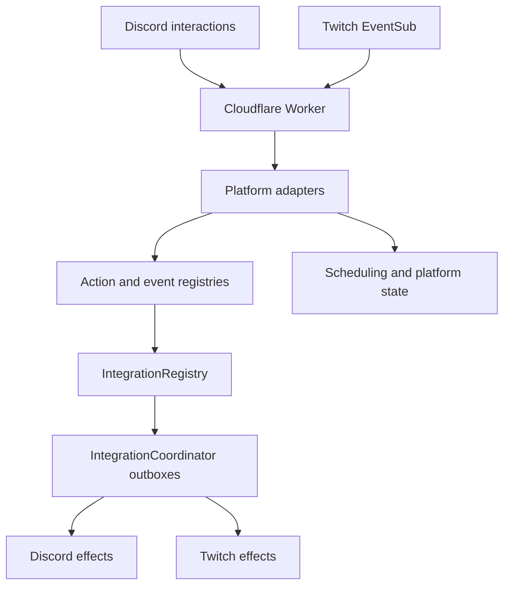

# Elmybot

Elmybot is a Discord and Twitch bot built as a Cloudflare Worker with Durable
Objects. Discord sends signed interactions to `/discord`; Twitch sends signed
EventSub webhooks to `/twitch`. No continuously running process or WebSocket
connection is required.

The bot supports platform-native commands as well as authenticated links between
Discord guilds and Twitch channels. Linked groups can exchange announcements,
publish stream-online notices, and add new cross-platform actions without forcing
both platforms to share the same command syntax or permissions.

## Features

- Discord slash commands for scheduling messages, role and user pings, GIFs,
  configuration, and delivery recovery.
- Twitch chat commands delivered through EventSub and the Twitch Send Chat
  Message API.
- Authenticated Discord–Twitch linking with independently configurable routes.
- Twitch stream-online notices sent to linked Discord channels.
- Announcements from Twitch to Discord and from Discord to Twitch.
- Contributor-owned per-group configuration, durable state, and atomic cooldowns.
- Durable EventSub inboxes, execution ledgers, effect outboxes, retries, and
  dead-letter inspection.
- Separate Twitch bot, app-token, and broadcaster OAuth lifecycles.
- Isolated test and production Twitch applications, bot accounts, Durable
  Objects, and callback origins.

## Architecture



`src/index.js` is the composition root. Platform adapters retain their own
request verification, command presentation, and authorization rules. Shared
contracts normalize identities, actions, events, routes, executions, and
effects only where cross-platform behavior benefits from a common model.

### Public routes

| Route | Purpose |
|---|---|
| `/discord` | Discord health check and signed interaction endpoint |
| `/twitch` | Twitch health check, EventSub challenges, notifications, and revocations |
| `/twitch/oauth/*` | Twitch bot-account OAuth |
| `/twitch/channels/*` | Broadcaster invitations, OAuth, and aggregate health |
| `/twitch/integrations/*` | Redeem, resume, resolve/finalize shareable state for, or cancel a Discord integration invitation |
| `/twitch/eventsub/*` | Protected subscription and desired-state administration |
| `/state-query/*` | Scoped readable-state discovery, snapshots, live SSE, sessions, grant issuance, query setup, and widgets |

Signed Discord and Twitch webhook bodies are limited to 256 KiB. Oversized
declared bodies are rejected before they are read; the actual UTF-8 size is
checked again before signature verification and JSON parsing.

### Durable Objects

| Binding | Class | Scope and responsibility |
|---|---|---|
| `SCHEDULER` | `GroupScheduler` | One per scheduling group; jobs, delivery ledger, retry, and dead letters |
| `CONFIG` | `GroupConfig` | One per platform group; operator configuration plus isolated feature config, state, and cooldowns |
| `TWITCH_APP_AUTH` | `TwitchAppAuth` | Singleton Twitch app-access-token lifecycle |
| `TWITCH_AUTH` | `TwitchAuth` | Singleton Twitch bot OAuth lifecycle |
| `TWITCH_CHANNEL_OAUTH` | `TwitchChannelOAuthCoordinator` | Singleton OAuth states and standalone invitation records |
| `TWITCH_CHANNEL_AUTH` | `TwitchChannelAuth` | One per broadcaster; channel authorization and recovery |
| `TWITCH_EVENTSUB_MANAGER` | `TwitchEventSubManager` | One per broadcaster; desired state and reconciliation |
| `TWITCH_EVENTSUB_SERVICE` | `TwitchEventSubService` | Singleton bounded access to Twitch's subscription API |
| `TWITCH_EVENTSUB_INBOX` | `TwitchEventSubInbox` | One per broadcaster; durable ingress, deduplication, retries, and dead letters |
| `TWITCH_CHANNEL_REGISTRY` | `TwitchChannelRegistry` | Singleton non-secret channel membership and health index |
| `INTEGRATION_REGISTRY` | `IntegrationRegistry` | Singleton authoritative link, membership, route, invitation, and audit state |
| `INTEGRATION_COORDINATOR` | `IntegrationCoordinator` | One per integration; durable execution ledger and effect outbox |
| `SHAREABLE_STATE_REALM` | `ShareableStateRealm` | One per standalone or integration realm; shareable namespaces, revisions, and notification outboxes |
| `STATE_QUERY_OBSERVER` | `StateQueryObserver` | One per logical platform group; deduplicated, coalesced state invalidations for future live queries |

All configured Durable Object classes use SQLite-backed namespaces. Migration
tags in `wrangler.jsonc` are append-only after deployment.

## Commands

Discord commands are registered globally through the one-off registration
script. All commands except `/alive` are guild-only.

### Discord

| Command | Options | Purpose |
|---|---|---|
| `/alive` | — | Check responsiveness |
| `/counter` | — | Increment the server's namespaced feature counter |
| `/deaths` | optional `operation` (`check`, `plus`, `minus`, `reset`), optional `game` | Check or update shared deaths on the server's default Twitch link |
| `/pingroleat` | `timestamp`, `role`, optional `repeat_daily` | Schedule a role ping |
| `/pingmeat` | `timestamp`, `user`, optional `repeat_daily` | Schedule a user ping |
| `/sayat` | `timestamp`, `message`, optional `repeat_daily`, `gif` | Schedule a message or GIF result |
| `/sayat_random` | `message`, optional `min_interval`, `max_interval`, `repeats`, `gif` | Schedule at a bounded random interval |
| `/doat_list` | — | List scheduled jobs |
| `/doat_cancel` | `job_id` | Cancel a scheduled job |
| `/doat_dead_letters` | — | Inspect terminal scheduling failures |
| `/config_allow_role` | `role` | Add a role to the bot's allowed-role list |
| `/config_disallow_role` | `role` | Remove an allowed role |
| `/config_list_entries` | — | List configuration keys |
| `/config_show_value` | `entry` | Inspect a configuration value |
| `/feature_config_set` | `feature`, `key`, `json_value` | Set an installed feature's namespaced configuration |
| `/feature_config_show` | `feature`, `key` | Inspect a feature configuration value |
| `/feature_config_delete` | `feature`, `key` | Delete a feature configuration value |
| `/state_query_grant` | `exports`, optional `duration_hours` | Create a scoped read credential in an ephemeral response |
| `/integration_link_twitch` | — | Create a secure Twitch linking invitation |
| `/integration_list` | — | List active integrations and IDs |
| `/integration_default_set` | `integration_id` | Select the server's default Twitch link |
| `/integration_status` | `integration_id` | Show membership, routes, and delivery aggregates |
| `/integration_route_set` | `integration_id`, `route`, `enabled`, optional `channel` | Enable, disable, or retarget a route |
| `/integration_audit` | `integration_id` | Show recent lifecycle and route history |
| `/integration_dead_letters` | `integration_id` | Inspect failed cross-platform effects |
| `/integration_retry_effect` | `integration_id`, `idempotency_key` | Retry one dead-lettered effect |
| `/integration_announce_twitch` | `message` | Send an announcement to linked Twitch channels |
| `/integration_schedule_twitch` | `message`, optional `min_interval`, `max_interval` | Repeatedly announce to linked Twitch channels at bounded-random intervals |
| `/integration_unlink` | `integration_id` | Revoke one integration without disconnecting Twitch OAuth |

Scheduling create/view/cancel capabilities allow the server owner, intrinsic
Discord moderators, and configured allowed roles. Configuration management
allows the owner and intrinsic moderators. Integration and state-query grant
management are stricter:
only the owner or a member with Administrator or Manage Server may link,
inspect, configure, recover, unlink integrations, or expose readable state. Announcements allow the
owner, intrinsic moderators, and configured allowed roles.

Random schedule intervals are expressed in seconds, must remain between 10
minutes and 24 hours, and default to 2–6 hours. This applies to local Discord
random messages and linked Twitch announcements. GIF queries are limited to 20
characters and are resolved at delivery time.

### Twitch

| Command | Authorization | Purpose |
|---|---|---|
| `!alive` | Any chatter | Check responsiveness |
| `!counter` | Any chatter | Increment the channel's namespaced feature counter |
| `!deaths [check|plus|minus|reset] [<game>]` | Any chatter checks; broadcaster or moderator updates | Check or update shared deaths on the channel's default Discord link |
| `!announce <message>` | Broadcaster or moderator | Send an announcement to linked Discord channels |

Command names are case-insensitive. `!deaths` and `!deaths check` use the last
game selected on Twitch by a broadcaster or moderator. Name a game only after
an operation and quote multi-word names, for example
`!deaths plus "Dark Souls"`. Discord remembers its own selected game, while
death counts are shared when both directional defaults select the same active
integration. `!announce` accepts at most 2,000 characters. Ordinary chat and
unknown commands are acknowledged after HMAC verification without creating a
durable inbox row.

`/counter` and `!counter` demonstrate the contributor state API. Each platform
group has an independent count, and each actor has a five-second atomic
cooldown. Operators can change its `label` setting with, for example,
`/feature_config_set feature:fun.counter key:label json_value:"Wins"`.

## Cross-platform linking

An authorized Discord manager runs `/integration_link_twitch` in the Discord
channel that should initially receive Twitch notices. The command creates a
one-use invitation that expires after 15 minutes. The Twitch broadcaster opens
the link, signs in to Twitch, and grants `channel:bot`; they do not need to make
the bot a moderator.

Successful authorization verifies Twitch and creates a durable pending link.
The browser is redirected to a safely refreshable pending page while the link
discovers shareable state. Empty, one-sided, and identical namespaces receive
automatic decisions; different nonempty namespaces wait for explicit
resolution. Only final activation creates an integration containing the
authenticated Discord guild and Twitch channel. Finalization briefly seals and
rechecks candidate namespaces, then either materializes a fresh shared realm or
returns to discovery if state changed. Its copy/reset operations and activation
transaction are replay-safe, so interrupted retries do not create duplicates.
See
[`docs/shareable-state-finalization.md`](docs/shareable-state-finalization.md).
Revoking the last selected link freezes its final shared realm and gives each
affected group a lazy, independent standalone successor; an eligible active
fallback continues on its own existing realm instead. See
[`docs/shareable-state-revocation.md`](docs/shareable-state-revocation.md).
The integration has three enabled routes:

| Route | Outcome |
|---|---|
| `discord.announce-to-twitch.v1` | `/integration_announce_twitch` sends to Twitch chat |
| `twitch.announce-to-discord.v1` | `!announce` sends to Discord |
| `twitch.stream-online-to-discord.v1` | `stream.online` invokes a feature action that publishes a Discord notice |

The first link becomes the directional default for both groups. Later links do
not replace an existing choice. Discord managers can identify the current link
in `/integration_list` and change the guild's choice with
`/integration_default_set`; unlinking a selected relationship falls back to the
oldest remaining active link. Discord-to-Twitch and Twitch-to-Discord choices
are independent, and there is no explicit unset while an eligible link remains.
Twitch currently follows automatic assignment and fallback but has no native
default-management command.

Routes can be disabled or retargeted independently. A Twitch channel may link
to multiple Discord guilds. Revoking a link preserves its audit history and
does not remove the broadcaster's platform-local authorization. Default
selection is independent from routes and origin-group state, but it selects
the ledger for features that explicitly use integration-owned state; see the
[management reference](docs/integration-management.md#default-link-model-and-invariants)
for the lifecycle, many-link, authorization, and concurrency guarantees.

## Twitch EventSub and delivery

Two EventSub definitions are currently registered:

- `twitch.chat.message.v1` for recognized Twitch commands.
- `twitch.stream.online.v1` for linked Discord stream notices.

After HMAC verification and definition-specific admission, notifications and
revocations enter one durable inbox per broadcaster. Twitch message IDs are the
deduplication keys. Inbox work and integration effects use bounded 20-item,
five-second drains, exponential retry backoff, and dead-letter states. Completed
inbox and integration execution records remain for 14 days.

EventSub reconciliation supports every installed definition. A single attempt
is bounded to five subscription-list pages, ten mutations, and a five-second
admission budget between external requests. Healthy periodic reconciliation is
jittered across 55–60 minutes.

The aggregate channel-health endpoint uses cursor pagination with a default and
maximum page size of 20. It evaluates four channels concurrently, limiting a
full broadcaster-OAuth page to at most 41 internal requests and eight component
requests in flight.

External delivery is intentionally **at least once**. Stable source-event and
effect keys prevent ordinary replays from creating duplicate work, but no local
transaction can make a third-party API call exactly once if execution stops
after the platform accepts a request and before local success is recorded.

## Configuration

### Worker values and secrets

| Name | Secret | Purpose |
|---|---:|---|
| `PUBLIC_KEY` | No | Discord application public key |
| `DISCORD_TOKEN` | Yes | Discord bot REST token |
| `KLIPY_API_KEY` | Yes | Optional scheduled-GIF API key |
| `KLIPY_API_KEY_NAME` | No | KLIPY client key/name |
| `TWITCH_CLIENT_ID` | No | Twitch application client ID |
| `TWITCH_CLIENT_SECRET` | Yes | Twitch confidential application secret |
| `TWITCH_BOT_USER_ID` | No | Numeric user ID of the Twitch bot account |
| `TWITCH_EVENTSUB_SECRET` | Yes | EventSub HMAC secret, 10–100 characters |
| `TWITCH_OAUTH_SETUP_TOKEN` | Yes | Bearer token protecting operator endpoints |
| `STATE_QUERY_DEPLOYMENT_ENVIRONMENT` | No | Committed `production` or `test` grant boundary |
| `STATE_QUERY_PUBLIC_ORIGIN` | No | Committed origin for grant OAuth and session cookies |
| `STATE_QUERY_CREDENTIAL_SIGNING_SECRET` | Yes | HMAC key rejecting forged grant-routing fields before Durable Object lookup |
| `TWITCH_DEPLOYMENT_ENVIRONMENT` | No | Committed `production` or `test` identity |
| `TWITCH_PUBLIC_ORIGIN` | No | Committed canonical callback and onboarding origin |

Use separate Twitch applications and bot accounts for test and production.
EventSub subscriptions belong to the application, so sharing one application
would let environments replace each other's callback subscriptions. The Worker
also verifies its canonical origin, Twitch client ID, and bot user ID.

`TWITCH_ACCESS_TOKEN` is obsolete and is not read.

The Discord registration script uses local environment variables:

| Mode | Variables |
|---|---|
| Production | `APP_ID`, `DISCORD_TOKEN` |
| Test (`--test`) | `TEST_APP_ID`, `TEST_DISCORD_TOKEN` |

## Setup and deployment

Requirements:

- Node.js 22
- A Cloudflare account with Workers and Durable Objects
- A Discord application and bot
- Separate Twitch applications and bot accounts for each deployment environment

Install the locked dependency graph and run the checks:

```powershell
npm ci
npm test -- --run
npm run lint
```

Configure the Worker secrets for each environment, for example:

```powershell
npx wrangler secret put PUBLIC_KEY --env test
npx wrangler secret put DISCORD_TOKEN --env test
npx wrangler secret put TWITCH_CLIENT_ID --env test
npx wrangler secret put TWITCH_CLIENT_SECRET --env test
npx wrangler secret put TWITCH_BOT_USER_ID --env test
npx wrangler secret put TWITCH_EVENTSUB_SECRET --env test
npx wrangler secret put TWITCH_OAUTH_SETUP_TOKEN --env test
npx wrangler secret put STATE_QUERY_CREDENTIAL_SIGNING_SECRET --env test
```

Set the environment-specific `TWITCH_PUBLIC_ORIGIN` and
`STATE_QUERY_PUBLIC_ORIGIN` values in `wrangler.jsonc`.
Register these Twitch OAuth callback URLs for each Worker host:

```text
https://<worker-host>/twitch/oauth/callback
https://<worker-host>/twitch/channels/oauth/callback
https://<worker-host>/state-query/operator/twitch/callback
```

Set the Discord interaction endpoint to:

```text
https://<worker-host>/discord
```

Deploy and register the Discord commands:

```powershell
# Test
npx wrangler deploy --env test
npm run discord-register -- --test

# Production/default
npx wrangler deploy
npm run discord-register
```

Authorize the Twitch bot account once per environment through the protected
`POST /twitch/oauth/start` endpoint. Broadcasters can then be onboarded through
the preferred Discord `/integration_link_twitch` flow. The protected
`POST /twitch/channels/invitations` endpoint remains available for standalone
Twitch onboarding; those invitations expire after one hour.

For example, start bot OAuth from PowerShell and open the returned URL:

```powershell
$workerUrl = "https://<worker-host>"
$setupToken = Read-Host "TWITCH_OAUTH_SETUP_TOKEN"
$headers = @{ Authorization = "Bearer $setupToken" }
$authorization = Invoke-RestMethod `
    -Method Post `
    -Uri "$workerUrl/twitch/oauth/start" `
    -Headers $headers
Start-Process $authorization.authorizationUrl
```

For local Worker development, run:

```powershell
npm run dev
```

## Operator endpoints

Except for public connect and callback pages, Twitch management endpoints
require:

```http
Authorization: Bearer <TWITCH_OAUTH_SETUP_TOKEN>
```

| Method and route | Purpose |
|---|---|
| `GET /twitch/configuration` | Inspect non-secret deployment, app, bot, and origin identity |
| `GET /twitch/channels/health` | Page through aggregate broadcaster OAuth and EventSub health |
| `POST /twitch/oauth/start` | Start bot-account OAuth |
| `POST /twitch/channels/invitations` | Create a standalone one-hour broadcaster invitation |
| `POST /twitch/channels/oauth/start` | Start broadcaster OAuth without an invitation |
| `GET /twitch/channels/oauth?broadcasterUserId=<id>` | Inspect broadcaster authorization metadata |
| `DELETE /twitch/channels/oauth?broadcasterUserId=<id>` | Revoke broadcaster authorization and deconfigure EventSub |
| `GET /twitch/app-auth` | Inspect non-secret app-token cache metadata |
| `GET /twitch/eventsub/subscriptions` | List application subscriptions |
| `POST /twitch/eventsub/subscriptions` | Create a registered subscription kind; defaults to chat |
| `GET /twitch/eventsub/service` | Compatibility alias for `GET /twitch/app-auth` |
| `GET /twitch/eventsub/channels?broadcasterUserId=<id>` | Inspect desired and recovery state |
| `POST /twitch/eventsub/channels` | Configure broadcaster desired state |
| `DELETE /twitch/eventsub/channels?broadcasterUserId=<id>` | Disable desired state and remove managed subscriptions |

State-query grant issuance is group-authorized rather than protected by the
operator-wide Twitch setup token. Discord server owners and members with
Administrator or Manage Server use `/state_query_grant`. Twitch broadcasters
open `GET /state-query/operator/twitch` and reauthenticate with Twitch. See the
[state-query HTTP and grant guide](docs/state-query-http.md) for credential,
catalog, snapshot, session, revocation, origin, and scope details.

After deployment, open `/state-query/setup` to compose and preview a query and
copy a `/state-query/widget` browser-source URL. OBS uses its own session;
enter the read grant through **Interact**. The [browser guide](docs/state-query-browser.md)
documents the client API, setup flow, and credential-free widget URLs.

## Project layout

```text
src/
  index.js                         Worker router and composition root
  actions/                         Platform-neutral action definitions and registry
  integrations/                    Contracts, routing, link registry, and effect coordinator
  message-scheduling/              Shared scheduling backend and registry
  platforms/
    discord/                       Interaction, command, permission, scheduling, and effect adapters
    twitch/                        OAuth, EventSub, inbox, command, registry, and effect adapters
packages/
  framework/                       Private package facade for Framework API v1 and its test kit
  features/alive/                  Build-time workspace feature-package proof
docs/                              Detailed architecture and lifecycle contracts
test/                              Core Worker, platform, integration, registry, and durability tests
wrangler.jsonc                     Bindings, environments, and append-only migrations
```

## Testing and CI

GitHub Actions runs the complete suite for pushes to `master` and
`codex-state-querying`, pull requests, and manual dispatches. CI:

1. installs dependencies with `npm ci`;
2. runs the complete Vitest suite;
3. runs ESLint;
4. runs a Chromium setup/widget smoke test and saves its preview;
5. checks tracked JavaScript and MJS syntax; and
6. performs a non-deploying Wrangler dry run.

The CI Wrangler dry run is the authoritative clean build/configuration check.

## Writing features

For a first command, start with [Your first Elmybot feature](docs/feature-quickstart.md).
It covers the shortest scaffold, install, test, and verification path, then
links to extra material by feature need. Use the longer
[feature authoring reference](docs/feature-authoring.md) for deployment-free
test-runtime details and complete native, shared, routed, scheduled,
event-driven, stateful, and conditionally authorized cookbooks. The
[installed feature catalog](docs/feature-catalog.md) is generated from registry
metadata with `npm run feature:docs`; `npm run lint` rejects a stale catalog.
The [Framework API v1 stability policy](docs/framework-api.md) defines the
supported import boundary, compatible changes, and deprecation lifecycle.

Create and validate the recommended private workspace package with:

```sh
npm run feature:new -- fun-hype --workspace
npm run feature:check -- fun-hype
```

The scaffold also offers optional `shared-command`, `local-counter`, and
`shareable-counter` recipes. They generate ordinary editable JavaScript and
focused tests; the minimal recipe remains the default. Add `--ready` to the
feature check before review to run the complete suite and every local
contributor gate. Checks are read-only; `npm run feature:docs` remains the
explicit catalog-regeneration action.

## Detailed documentation

- [First-feature quickstart](docs/feature-quickstart.md)
- [Feature authoring reference and cookbooks](docs/feature-authoring.md)
- [When to ask for framework help](docs/feature-authoring.md#ask-for-framework-help-when)
- [Feature operator checklist](docs/feature-operator-checklist.md)
- [Cross-platform contracts](docs/cross-platform-contracts.md)
- [Action registry](docs/action-registry.md)
- [Integration linking and routes](docs/integration-linking.md)
- [Durable integration execution](docs/integration-execution.md)
- [Integration management and recovery](docs/integration-management.md)
- [EventSub subscriptions and durable inbox](docs/eventsub-pipeline.md)
- [Feature configuration, state ownership, and cooldowns](docs/feature-state.md)
- [Composable state queries and live subscriptions roadmap (proposed)](docs/state-querying-roadmap.md)
- [Public state-query contract](docs/state-query-contract.md)
- [State-query live transport and cost decision](docs/state-query-transport-decision.md)
- [Readable state declarations and subject metadata](docs/state-query-readable-state.md)
- [Read-only composable state-query evaluator](docs/state-query-evaluator.md)
- [State-query read grants, discovery, and snapshot HTTP API](docs/state-query-http.md)
- [Recoverable state-query change notifications](docs/state-query-notifications.md)
- [Public state-query SSE delivery](docs/state-query-sse.md)
- [Deaths state-query proof and contributor workflow](docs/state-query-deaths-proof.md)
- [Browser query setup, client, and OBS widget](docs/state-query-browser.md)
- [Shareable feature-state lifecycle contract](docs/shareable-state-lifecycle.md)
- [Shareable-state collision discovery](docs/shareable-state-discovery.md)
- [Pending integration state resolution](docs/shareable-state-resolution.md)
- [Shareable-state revocation and standalone continuation](docs/shareable-state-revocation.md)
- [Shareable-state lifecycle verification](docs/shareable-state-lifecycle-verification.md)
- [Framework API v1 stability and deprecations](docs/framework-api.md)
- [Generated installed feature catalog](docs/feature-catalog.md)

## External references

- [Cloudflare Durable Objects](https://developers.cloudflare.com/durable-objects/)
- [Cloudflare Durable Object alarms](https://developers.cloudflare.com/durable-objects/api/alarms/)
- [Discord interactions](https://discord.com/developers/docs/interactions/overview)
- [Twitch chatbots](https://dev.twitch.tv/docs/chat/)
- [Twitch EventSub webhooks](https://dev.twitch.tv/docs/eventsub/handling-webhook-events)
- [Twitch token validation](https://dev.twitch.tv/docs/authentication/validate-tokens/)
