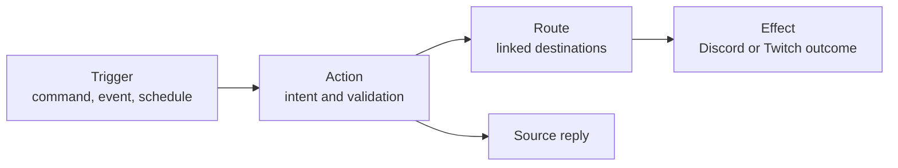

# Command and feature framework design

## Status

This document is the design overview and implementation plan. The stable
normative Framework API v1 contract is in
`docs/command-feature-framework-contract.md`. The project owner approved that
contract on 2026-08-30, and implementation steps 1–10 are complete. The public
entry point, compatibility rules, and deprecation policy are recorded in
`docs/framework-api.md`. Step 10 establishes private npm workspaces; independent
package publication remains a possible later extension.

## Motivation

Elmybot should be usable as a canvas for contributors who primarily want to
write fun and interesting commands. A contributor should be able to add a
platform-native, shared, or cross-platform feature without first learning the
details of Durable Object addressing, webhook authentication, integration
execution envelopes, idempotency ledgers, or retry machinery.

The target experience is:

> A contributor adds a command in one feature folder, registers it once, and
> can use replies, linked-platform routing, scheduling, permissions,
> configuration, and durable delivery through a small, documented API.

The first version should be an in-repository contributor framework. Feature
code remains reviewed, committed, tested, and bundled into the Worker. Loading
arbitrary third-party code at runtime is not part of this design. Build-time
feature packages can be considered after the framework API is stable.

## Author mental model

Feature authors should normally need four concepts:



| Feature type | Pipeline |
| --- | --- |
| Discord-only command | Discord command -> action or native handler -> Discord reply |
| Twitch-only command | Twitch command -> action or native handler -> Twitch reply |
| Shared command | Discord and Twitch adapters -> one shared action |
| Cross-platform command | Source command -> action -> integration route -> target effect |
| Automatic interaction | Platform event -> action -> integration route -> target effect |
| Scheduled interaction | Schedule -> action -> optional route -> effect |

Platform-specific behavior remains first-class. A feature enters the shared
action layer only when that semantic boundary is useful. Discord components,
embeds, autocomplete, and permissions and Twitch-specific parsing or behavior
must not be reduced to a lowest-common-denominator command format.

## Existing foundation

The project already has most of the low-level execution model:

- versioned `CommandInvocation`, `ActionResult`, `DomainEvent`, `Effect`, and
  `IntegrationExecution` contracts;
- an immutable action registry;
- platform-owned Discord and Twitch ingress adapters;
- explicit capability authorization;
- authenticated integration linking and configurable routes;
- durable per-integration execution ledgers and effect outboxes;
- Discord-message and Twitch-chat effects;
- EventSub definitions backed by a durable inbox;
- a generic scheduling backend; and
- stable replay protection, retries, and dead-letter handling.

The principal missing layer is contributor-facing composition. At present, a
new cross-platform feature may require edits to command maps, action sets, route
constants and defaults, permission policies, the Worker composition root,
documentation, and several test fixtures.

## Proposed feature model

Introduce a validated `defineFeature()` contract and one explicit installed
feature catalog. The exact proposed manifest, context, command, route, event,
schedule, compatibility, and example contracts are specified in
`docs/command-feature-framework-contract.md`. The following remains a compact
conceptual preview:

```js
export default defineFeature({
  id: "fun.hype",

  actions: [
    defineAction({
      kind: "integration.hype.publish.v1",
      origins: ["discord"],
      access: "moderators",
      args: {
        message: text({ maxLength: 500 })
      },
      execute(ctx, { message }) {
        return {
          reply: ctx.text("Hype queued!"),
          effects: ctx.routes("discord.hype-to-twitch.v1")
            .twitchChat({ message })
        };
      }
    })
  ],

  commands: {
    discord: [
      slashCommand({
        name: "hype_twitch",
        description: "Send hype to linked Twitch chats.",
        action: "integration.hype.publish.v1"
      })
    ]
  }
});
```

The normative contract favors explicit, easily tested results over hidden side
effects: actions return output and effect envelopes, and the framework submits
validated effects afterward.

Features would be installed explicitly:

```js
export const installedFeatures = [
  aliveFeature,
  announcementFeature,
  streamOnlineFeature
];
```

The framework would validate and aggregate feature declarations into the
existing command, action, route, event, scheduler-handler, and effect
registries. Explicit installation is deterministic, works with Worker bundling,
and makes review easier than runtime filesystem discovery.

An intended source layout is:

```text
src/
  framework/
    define-feature.js
    feature-registry.js
    command-context.js
    argument-schema.js
    access-policies.js
    routing.js
    scheduling.js
    testing.js
  features/
    alive/
      feature.js
      feature.spec.js
    announcements/
      feature.js
      feature.spec.js
    stream-online/
      feature.js
      feature.spec.js
```

Startup must fail for duplicate command names, semantic kinds, route kinds,
incompatible definitions, unknown capabilities, and effects without registered
target adapters.

## Contributor-facing capabilities

### Platform command adapters

Provide helpers for common command shapes, such as `slashCommand()`,
`twitchCommand()`, and `exposeAction()`. They should cover:

- argument extraction and normalization;
- required and optional arguments;
- Discord command registration descriptors;
- Twitch rest-of-message and token parsing;
- deferred Discord responses; and
- common text replies and user-facing validation failures.

Custom platform adapters must remain possible for native behavior that does not
fit these helpers.

### Runtime-validated argument schemas

Keep the project in plain JavaScript while adding runtime schemas and JSDoc.
For example:

```js
args({
  message: text({ required: true, maxLength: 500 }),
  amount: integer({ min: 1, max: 100 }),
  target: user()
});
```

One semantic schema can support validation and tests. Platform adapters may
customize how an argument is displayed or parsed.

### Controlled feature context

Normal feature actions should receive a controlled context instead of raw
Worker bindings:

```js
ctx.source
ctx.actor
ctx.reply
ctx.routes
ctx.effects
ctx.schedule
ctx.links
ctx.config
ctx.state
ctx.integrationState
ctx.log
ctx.correlationId
```

This context should hide secrets, Durable Object names, storage layouts,
external-request timeouts, execution envelopes, and coordinator submission.
Advanced lower-level APIs can remain available through an explicitly separate
interface.

### Permissions and capabilities

Offer reviewed access presets for common features:

```js
access: "everyone"
access: "members"
access: "moderators"
access: "managers"
access: capability("integration.announcement.publish")
```

Platform adapters map these policies to authoritative evidence, such as
Discord permissions and configured roles or Twitch broadcaster and moderator
claims. A feature cannot create an arbitrary authorization function that grants
itself authority. Genuinely new sensitive capabilities require an explicit
central policy addition and review.

When one validated command mode is public and another is protected, an action
may explicitly request `ctx.authorization` and ask whether the current actor
has a reviewed capability. Platform policy still owns the decision; the
feature receives no raw Discord roles, Twitch badges, or custom authorizer.

### Route catalog

Replace scattered route declarations and management choices with a registered
route catalog:

```js
defineRoute({
  kind: "discord.hype-to-twitch.v1",
  sourcePlatform: "discord",
  targetPlatform: "twitch",
  destination: "none",
  newIntegration: "enabled",
  existingIntegration: "disabled"
});
```

The catalog should drive validation, integration defaults, route-management
choices, documentation, and expected target platforms.

New routes need an explicit existing-integration policy. The safe default is
for newly installed feature routes to remain disabled on existing links until
a manager enables them. A deliberate migration may opt into different behavior.

### Platform-owned effect factories

Most feature authors should use platform-owned factories such as:

```js
ctx.effects.discord.message(...)
ctx.effects.twitch.chat(...)
```

Creative platform operations can add versioned effect kinds such as
`discord.role.assign.v1`, `discord.reaction.add.v1`, `twitch.poll.start.v1`, or
`twitch.announcement.send.v1`. Each new kind retains a target-platform validator
and delivery adapter. Feature authors do not modify coordinator persistence or
retry logic.

### Commands, events, and schedules as triggers

The same action should be invokable from a Discord command, Twitch command,
verified domain event, or scheduled occurrence. This lets one semantic action
support immediate, automatic, and recurring behavior.

The scheduled-action bridge must:

- create a unique stable source ID for every occurrence;
- resolve active routes when that occurrence fires;
- persist the resolved occurrence plan before fan-out;
- replay the immutable plan during retries; and
- hand effects to integration coordinators rather than delivering externally.

A future authoring API could resemble:

```js
await ctx.schedule.action({
  action: "integration.hype.publish.v1",
  args: { message },
  timing: randomInterval({ minSeconds: 900, maxSeconds: 1800 }),
  repeats: true
});
```

### Namespaced configuration, state, and cooldowns

Fun commands commonly need counters, quotes, scores, cooldowns, and per-group
settings. Provide distinct facilities:

- `ctx.config` for operator-controlled settings;
- `ctx.state` for feature-owned durable state local to the origin group; and
- `ctx.integrationState.for(link)` for feature-owned durable state shared by
  the active integration selected through an invocation-local default link.

Both are automatically scoped by feature and platform group. Storage size and
operation limits prevent one feature from becoming an unbounded shared-state
consumer or reading another feature's data.

Shared action code does not imply shared storage, and linking groups does not
merge their namespaces. Intentionally shared mutable data belongs to an
integration identity. The integration-state service keeps that choice explicit:
the current directional default selects the ledger, switches do not copy data,
and revocation blocks access without erasing the old integration's namespace.

Cooldowns should be declarative where possible:

```js
cooldown: {
  scope: "actor",
  seconds: 30
}
```

## Testing and tooling

Provide a feature test harness that runs without deployment and can model
platform actors, permissions, integration routes, effects, schedules, and
events. A conceptual test is:

```js
const runtime = createFeatureTestRuntime(hypeFeature);

const result = await runtime.discord.command("hype_twitch", {
  actor: discordModerator(),
  args: { message: "Let's go!" },
  routes: [linkedTwitchChannel()]
});

expect(result).toReply("Hype queued!");
expect(result).toEmitTwitchChat("Let's go!");
```

The harness should support:

- Discord and Twitch actors;
- allowed and denied capability cases;
- linked and unlinked groups;
- fake schedules and clock advancement;
- EventSub-derived domain events;
- emitted-effect inspection;
- coordinator replay simulations; and
- automatic contract checks for every feature.

A scaffold command such as the following creates the recommended private
workspace package and its test skeleton:

```text
npm run feature:new -- fun-hype --workspace
```

Omit `--workspace` when the feature is intentionally repository-local.

Feature metadata should also become the source for generated Discord
registration descriptors, command documentation, and route-management choices
so those representations cannot silently drift.

## Implementation sequence

1. **Write and approve the framework contract — completed.** The approved
   contract lives in `docs/command-feature-framework-contract.md` and specifies
   the exact `defineFeature()` schema, context API, compatibility policy, and
   three complete example features.
2. **Add the feature registry and installation catalog — completed.** The
   runtime now has a strict `defineFeature()`, an explicit installed-feature
   catalog, immutable action and per-platform command contribution registries,
   and collision-safe merging with legacy action and command sets. The catalog
   began empty so representative features could be migrated deliberately.
3. **Add Discord and Twitch command helpers — completed.** The framework now
   provides runtime argument schemas, reviewed access presets, separate
   action-backed and native command definitions, Twitch parsers, safe text
   renderers, Discord option/registration generation, and composition checks
   tying action commands to installed actions.
4. **Migrate representative local behavior — completed.** The installed
   `core.alive` feature now owns one shared action exposed as Discord `/alive`
   and Twitch `!alive`. The installed `discord.role-access` feature owns the
   Discord-native `/config_allow_role` command and uses a narrow adapter service
   instead of raw Worker bindings. All other commands remain on their legacy
   registrations; this is intentionally not a big-bang conversion.
5. **Add the route catalog and effect helpers — completed.** Installed
   features now contribute validated route definitions, actions declare their
   route and effect dependencies, and controlled context factories construct
   routed Discord-message and Twitch-chat effects. Both announcement commands
   now belong to one installed feature; platform executors submit its results
   through the existing durable coordinator without feature code constructing
   integration envelopes or handling retries.
6. **Add scheduled-action and event-action adapters — completed.** Authenticated
   domain events can now map into installed actions, and `stream.online` uses
   that path. Scheduled-action definitions capture authorization at creation;
   every occurrence resolves current routes, persists an immutable action,
   route, and effect plan, and replays that plan on scheduler retries. The
   installed `/integration_schedule_twitch` proof repeatedly invokes the same
   announcement action at bounded-random intervals.
7. **Add namespaced configuration, state, and cooldowns — completed.** Actions
   opt into frozen `authorization`, `config`, `integrationState`, `links`,
   `state`, and `random`
   services;
   conditional authorization delegates to platform policy, while per-group
   SQLite namespaces enforce key, value-size, and entry-count bounds; and declarative
   actor or group cooldowns are claimed atomically before execution. Protected
   Discord commands manage installed-feature configuration. The shared
   `/counter` and `!counter` proof uses a configurable label, atomic increment,
   and actor cooldown without accessing Worker bindings or storage layouts.
   The additive bounded-counter API maps arbitrary subjects to safe internal
   keys and applies each floor/ceiling check in the same atomic mutation.
   Validated conditional-access metadata lets generated catalogs distinguish a
   public baseline from argument modes protected by a reviewed capability.
8. **Complete the test kit, scaffold, and contributor guide — completed.** The
   deployment-free test runtime composes real feature contracts while modeling
   actors, authorization, routes, effects, events, schedules, stored-plan
   replay, configuration, state, cooldowns, clock, randomness, and logs. The
   non-overwriting `npm run feature:new -- <name>` scaffold creates one local
   feature module and one test skeleton. A short first-feature quickstart owns
   the scaffold-to-test path and routes authors by need; the authoring reference
   provides native, shared, routed, scheduled, event-driven, and stateful
   cookbooks. The generated installed-feature catalog and lint freshness check
   keep contributor documentation tied to registry metadata.
9. **Stabilize and version the framework API — completed.** Feature manifests
   bind to exported `frameworkApiVersion`; unsupported versions fail with a
   machine-readable compatibility error. `src/framework/index.js` now exposes
   a deliberately tested contributor surface while registry, adapter, service,
   and storage composition moved behind an explicitly internal entry. ESLint
   mechanically prevents feature modules from importing project internals, and
   `docs/framework-api.md` defines compatible changes, API-major changes, the
   deprecation lifecycle, and the current compatibility alias.
10. **Add the first build-time feature-package form — completed.** Private npm
    workspaces now expose `@elmybot/framework` and its test kit, while
    `@elmybot/feature-alive` proves independent feature source, metadata, tests,
    explicit installation, Worker bundling, and compatibility re-exports. The
    recommended `npm run feature:new -- <name> --workspace` scaffold creates the
    complete package shape; validation checks
    names, exports, framework peer versions, metadata, and feature definitions;
    and ESLint prevents package source from escaping into Worker internals.
    Runtime-loaded code and external package publication remain out of scope.
11. **Expose directional default-link identity — completed.** Actions explicitly
    opt into the read-only `links` service and call
    `ctx.links.default(targetPlatform)`. The runtime fixes the source to the
    invocation group and returns only a frozen integration/source/target
    snapshot or `null`; mutation, candidate listing, audit history, and registry
    storage remain platform-owned. The test kit models each direction with
    `defaultTestLink()`. Resolving identity does not merge the two groups'
    `ctx.state` namespaces.
12. **Expose controlled integration-owned feature state — completed.** Actions
    resolve a default-link snapshot and pass that exact invocation-local
    capability to `ctx.integrationState.for(link)`. The per-integration
    coordinator verifies active membership and stores a feature namespace with
    the same bounded operations as group state. The redesigned `fun.deaths`
    feature keeps its remembered game local to each platform group while both
    directions of one selected integration share a death ledger.

## Shareable-state follow-up sequence

The next initiative lets declared feature state work standalone and reconcile
when groups link. Each step is intended to land and pass CI independently:

1. **Define the shareable-state lifecycle contract — completed.** The
   [lifecycle contract](shareable-state-lifecycle.md) fixes realm ownership,
   discovery, collision outcomes, concurrency seals, directional defaults,
   cancellation, revocation successors, relinking, recovery, privacy, and
   compatibility before adding storage APIs.
2. **Add declarative shareable-state metadata — completed.** Features may now
   declare frozen namespace IDs, labels, schema compatibility, safe collision
   summaries, and bounded limits. The metadata appears in the generated catalog
   and gates the later realm and resolution stages.
3. **Implement standalone shareable-state realms — completed.** The internal
   [`ShareableStateRealm`](shareable-state-realms.md) Durable Object now gives
   each platform group an isolated, declaration-gated realm with canonical
   values, namespace limits, schema identity, and atomic mutation versions.
   Effective selection is provided by the next completed step.
4. **Add effective-state resolution — completed.** Actions belonging to a
   feature with declared namespaces may request `shareableState` and pin one
   namespace through `current(otherPlatform, namespaceId)`. No default selects
   the origin group's standalone realm; an active default selects that
   integration's realm. Existing `integrationState` remains available while
   lifecycle reconciliation and feature migrations are still staged.
5. **Add snapshot, fingerprint, and cloning primitives — completed.** Internal
   realm infrastructure can capture one declared namespace as an immutable,
   versioned snapshot, derive a deterministic content fingerprint and bounded
   feature-approved summary, compare compatible snapshots, and clone verified
   content into a fresh realm. These capabilities are deliberately absent from
   feature action contexts.
6. **Introduce the pending-integration lifecycle — completed.** Twitch
   verification creates a resumable `awaiting_state_resolution` record;
   pending links can expire or be cancelled and become active only through the
   idempotent protected activation operation.
7. **Implement generic collision discovery.**
8. **Add the collision-resolution page.**
9. **Make finalization concurrency-safe and idempotent.**
10. **Implement revocation and standalone continuation.**
11. **Add lifecycle, security, concurrency, and many-link tests.**
12. **Migrate `fun.deaths` to shareable state.**

## Success criteria

The contributor framework is ready for creative feature authors when:

- a simple platform command needs one feature module and one focused test;
- a cross-platform command declares a route and target outcome without manually
  constructing integration execution envelopes;
- scheduled and event-driven triggers can invoke the same actions as commands;
- command registration, route management, and documentation derive from feature
  metadata;
- feature code does not handle OAuth tokens, Durable Object IDs, retry loops,
  raw webhook payloads, or storage table layouts;
- validation errors and authorization denials are safe and understandable;
- platform-native behavior remains easy and first-class; and
- existing low-level contracts remain available for exceptional advanced work.

The recommended proof set is:

1. `alive`, demonstrating one action exposed through both command systems;
2. announcements, demonstrating bidirectional routed actions; and
3. a bounded-random scheduled Discord-to-Twitch message, demonstrating
   authorization, scheduling, route resolution, immutable occurrence planning,
   durable coordinator handoff, and Twitch delivery; and
4. `counter`, demonstrating namespaced configuration, atomic state, and
   declarative actor cooldowns through one action on both platforms.

Together, these examples exercise the complete contributor pipeline without
forcing every future command to use every layer.
